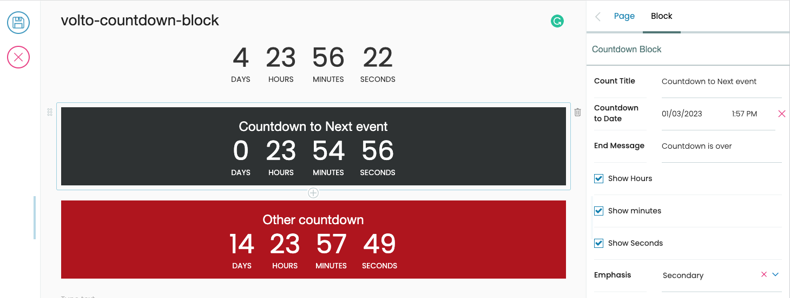

# volto-countdown-block

A [Plone/volto](https://plone.org/why-plone) [block](https://6.dev-docs.plone.org/volto/blocks/index.html) [add-on](https://6.dev-docs.plone.org/volto/addons/index.html) for a countdown block.
Countdown to any date/time you specify.

## Features

### Volto Countdown date/time

A example of Volto Countdown to any date/time you specify, it look like the following capture:

---

## Customizable properties

1. `title` (_string_): The heading text.
1. `countToDate` (_date_): Date/time to countdown to.
1. `endMessage` (_string_): Message to show after the date/time specified is reach.
1. `showHour` (_boolean_): Show Hours.
1. `showMinute` (_boolean_): Show Minutes.
1. `showSecond` (_boolean_): Show Seconds.
1. `emphasis` (_choice_): Class used on the countdown block.

## Copyright and license

The Initial Owner of the Original Code is Rafael Nunez.
All Rights Reserved.

See [LICENSE.md](https://github.com/rnunez80/volto-countdown-block/blob/master/LICENSE.md) for details.
